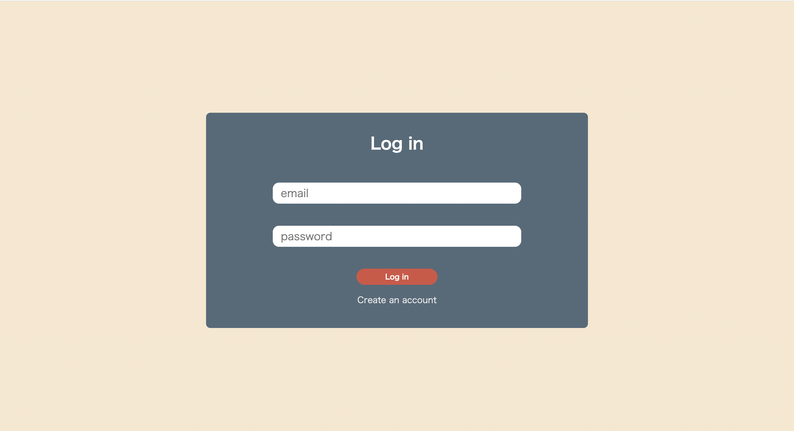
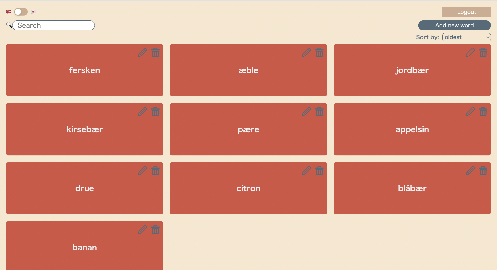
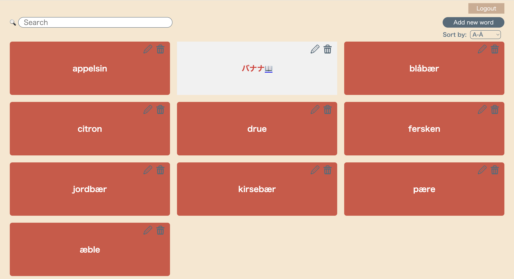
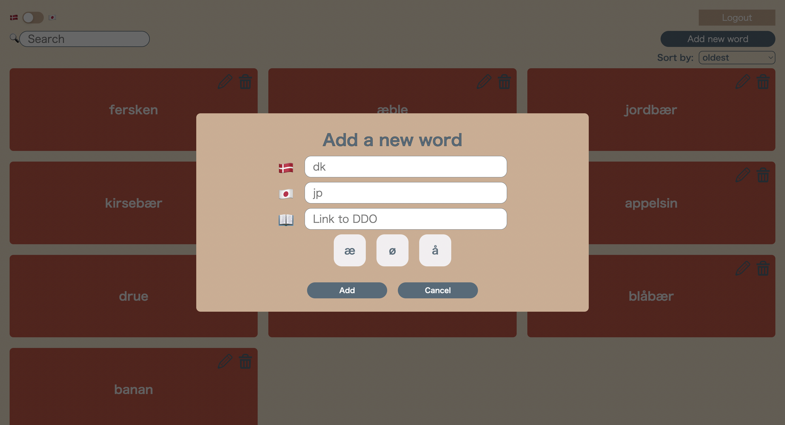
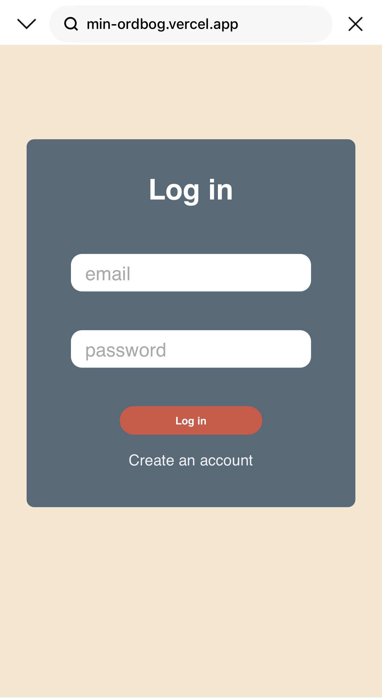
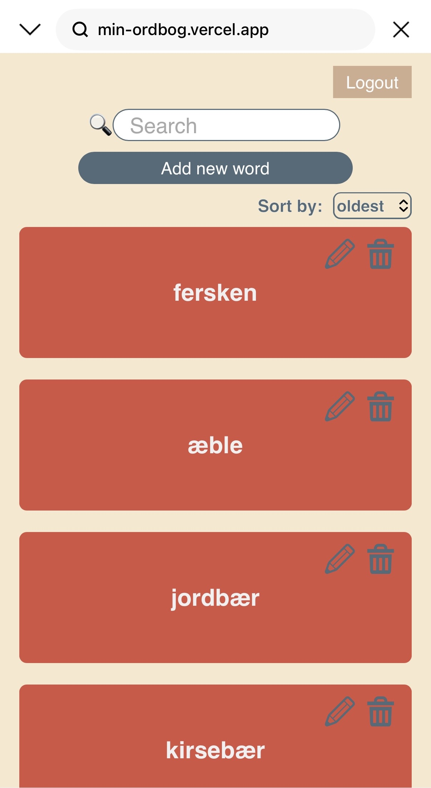
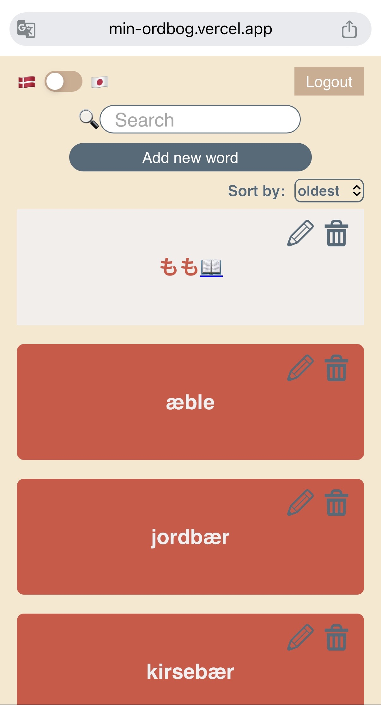
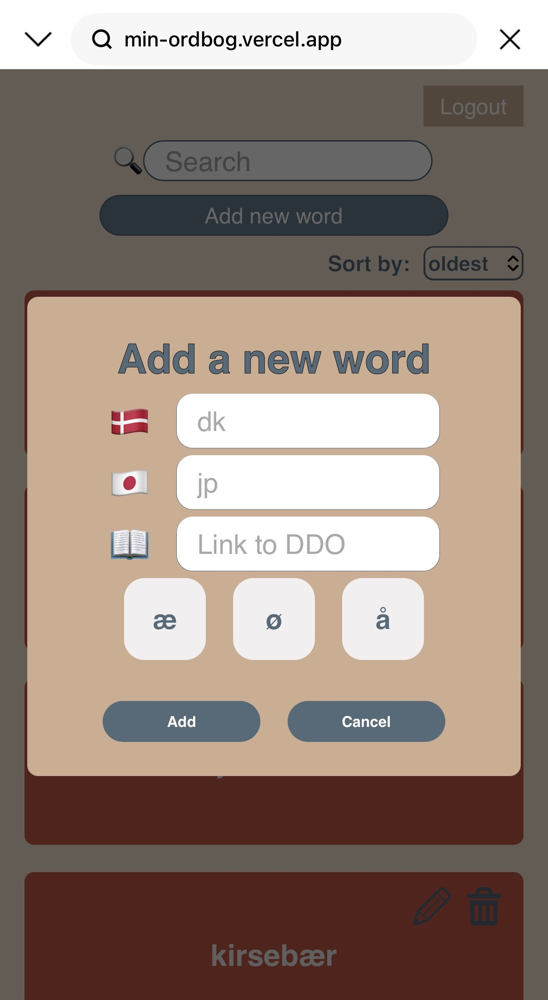

# 📖 My own danish-japanese wordbook🇩🇰🇯🇵
A simple Danish vocabulary learning app for japanese speaker.
Users can sign up, log in, add words, edit them, delete them, and search.

## 📝 Features
- User authentication with Supabase
- Add / edit / delete words
- Sort words (oldest / latest / alphabetical / random)
- Search by danish words
- Stores data per user (RLS enabled)
- Quick access to DDO(Den Danske Ordbog)
- On-screen special character input (å, æ, ø)
- Responsive(PC/iPad/iPhone)

## 👀 Sneak peak

- Login



- After login, you will have your own wordbook!



- One-tap access to Japanese meanings
- Open the DDO page with the book icon
- Words can be easily edited or deleted as needed



- Add/edit form with special character input (æ, ø, å)



【Layout for mobile】





## 💻 Tech Stack
<p>
  
</p>


## 🗂️ Project structure
```
- src/
 ├── components/  # Reusable UI components
 ├── hooks/       # Custom hooks
 ├── pages/       # Page level components
 ├── styles/      # SCSS modules (structured by base / layout / components / pages / variables)
 └── utils/       # Helper functions
```


## 🔗 Deployment
This app is deployed on Vercel: 
https://min-ordbog.vercel.app/


## 💡 Upcoming features
- Allow users to archive learned words instead of deleting them
- Enable switching the card’s base language between Danish and Japanese
